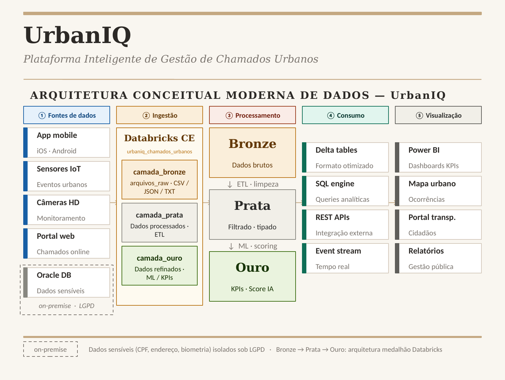
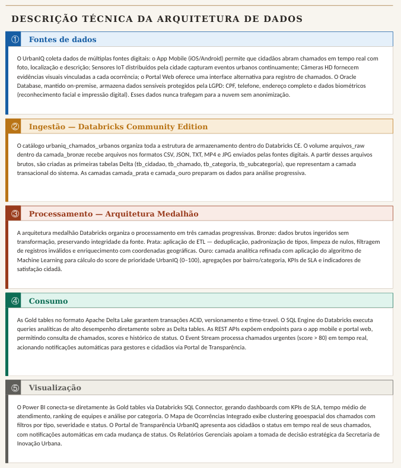
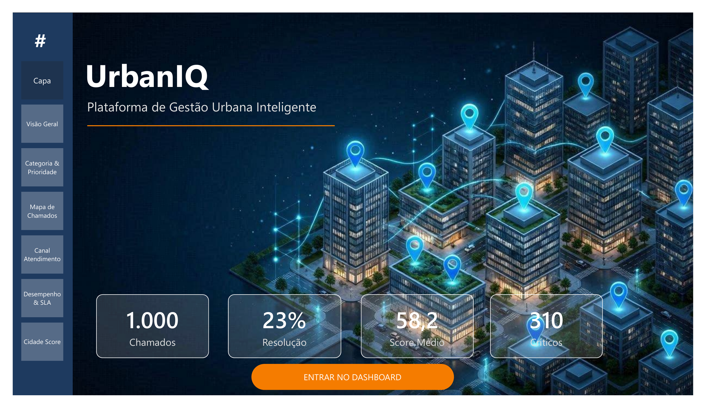
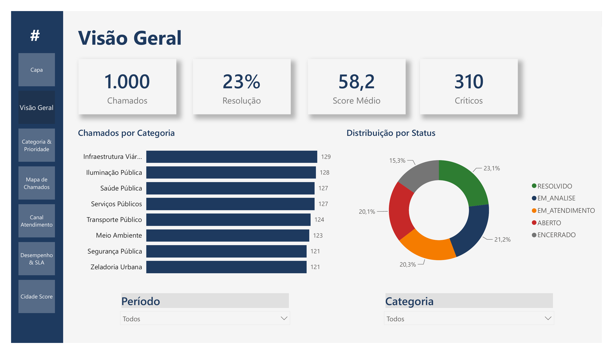
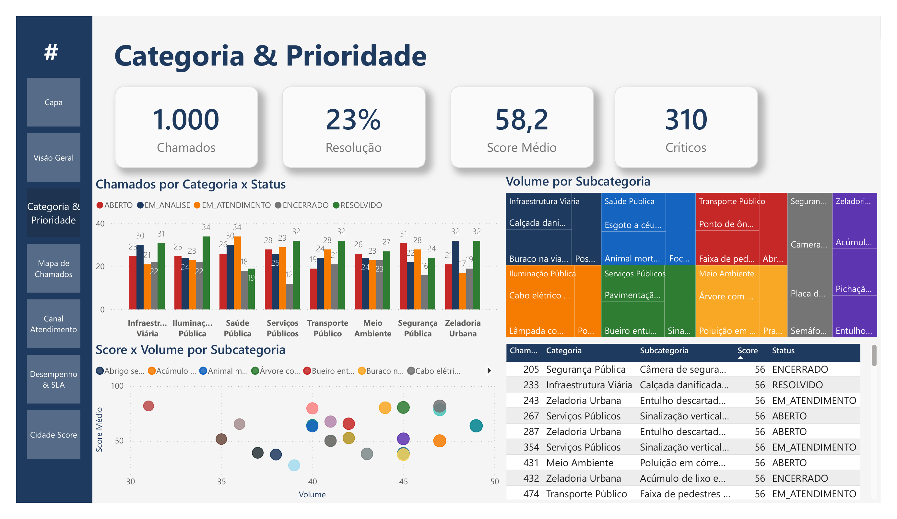
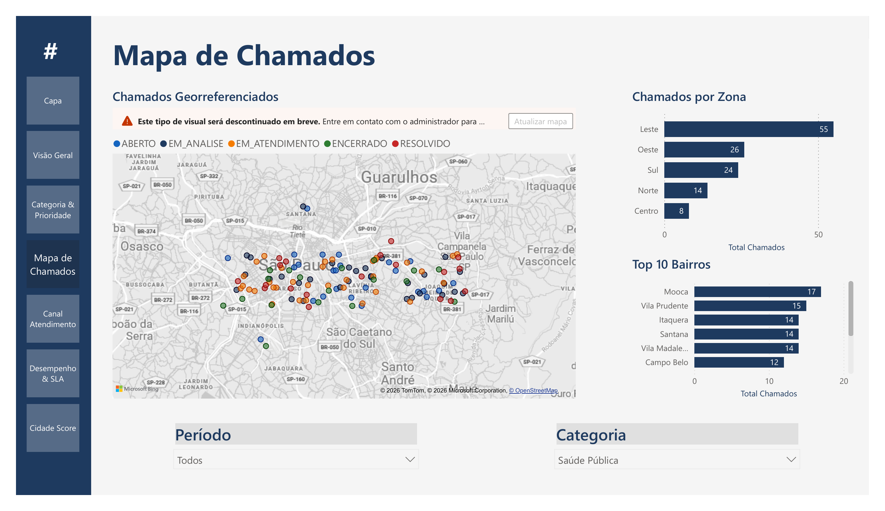
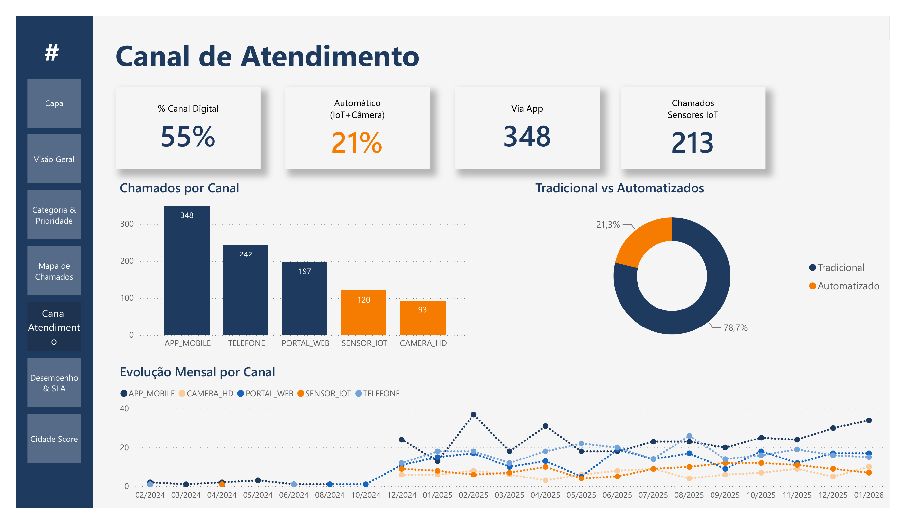
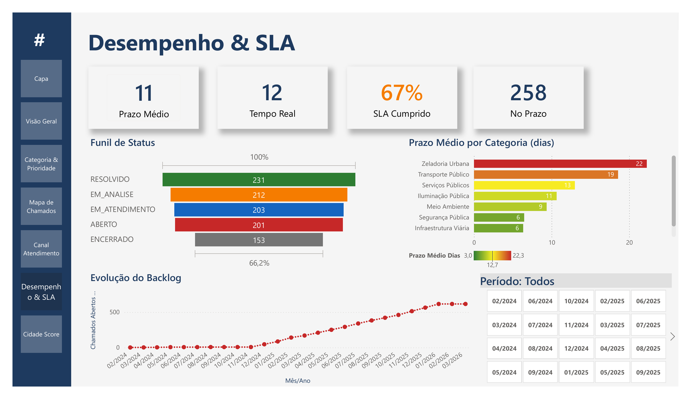
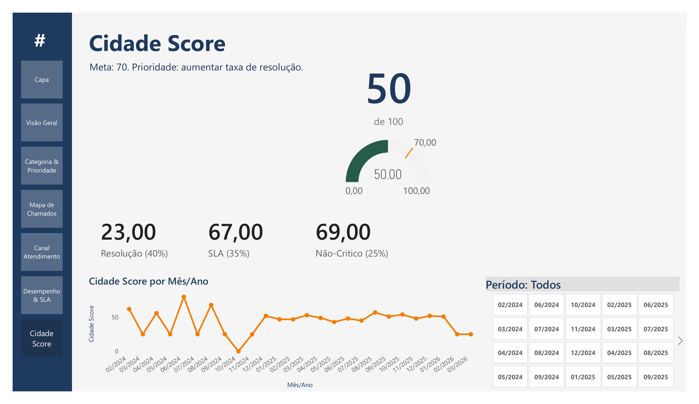

<div align="center">

# UrbanIQ

### Plataforma Inteligente de Gestão de Chamados Urbanos

*Transformando dados urbanos em decisões inteligentes — com priorização automática, transparência em tempo real e melhoria contínua dos serviços públicos.*

<br>


</div>

---

## Sobre o Projeto

**UrbanIQ** é uma plataforma de dados que centraliza, prioriza e dá transparência aos chamados urbanos de uma cidade. Em vez de pedidos de serviço público que se perdem entre canais desconexos, o UrbanIQ unifica as solicitações dos cidadãos, prioriza automaticamente por impacto e urgência e devolve à população acompanhamento em tempo real — reconstruindo a confiança entre cidadão e gestão pública.

O projeto nasce do **Desafio 3 — Participação Cidadã e Serviços Públicos** da cidade fictícia *Alfa*, no contexto do PBL (*Project Based Learning*) da FIAP, e é desenvolvido como um **pipeline de dados completo de 7 fases**, da descoberta do problema à entrega de um produto de dados com impacto social.

> **Visão de produto:** ser a ponte inteligente entre o problema do cidadão e a ação da gestão pública, orientada por dados.

---

## O Problema

A persona central do projeto é **Fernanda Borges**, 34 anos, cidadã que registra um chamado de infraestrutura e enfrenta uma jornada de frustração:

| Dor | Consequência |
|-----|--------------|
| Falta de retorno e acompanhamento | Cidadão sem saber o andamento do pedido |
| Informações inconsistentes entre canais | Perda de confiança no serviço público |
| Demora na resolução | Riscos urbanos persistem por meses |
| Baixa transparência e previsibilidade | Desengajamento da população |

**Diagnóstico raiz:** a falha não está só na operação, mas na ausência de uso inteligente dos dados para priorizar, analisar e decidir.

---

## A Solução

| O UrbanIQ **é** | O UrbanIQ **faz** |
|----------------|-------------------|
| Plataforma inteligente de gestão de chamados | Centraliza dados de múltiplos canais |
| Sistema orientado por dados para decisão | Classifica e prioriza chamados automaticamente |
| Solução integrada cidadão ↔ gestão pública | Permite acompanhamento em tempo real |
| Ferramenta de priorização por impacto e urgência | Gera insights e identifica tendências urbanas |

---

## Arquitetura de Dados Distribuída

A arquitetura separa **dados sensíveis** (on-premise, sob LGPD) de **dados massivos** (nuvem), com processamento em **arquitetura medalhão** (Bronze, Prata, Ouro):

<div align="center">





</div>

**Princípios de design:**

- **Privacidade by design** — CPF, endereço e dados biométricos isolados on-premise, em conformidade com a LGPD.
- **Escalabilidade** — camada de nuvem preparada para grandes volumes (sensores, logs, eventos) e acessos simultâneos.
- **Tempo real** — *event stream* para notificação automática de chamados críticos (score elevado).

---

## Modelo de Dados

Modelo físico relacional em **Oracle Database 21c**, normalizado até a **3ª Forma Normal**.

<div align="center">

| Métrica | Valor |
|---------|:-----:|
| Tabelas | **15** |
| Chaves estrangeiras | **17** |
| Sequences | **14** |
| Índices de performance | **7** |
| Prefixo padrão | `T_URB_` |

</div>

**Tabela central:** `T_URB_CHAMADO` — armazena cada chamado urbano com `NR_SCORE_PRIORIDADE` (0–100, calculado pelo motor de priorização) e ciclo de status `ABERTO → EM_ANALISE → EM_ATENDIMENTO → RESOLVIDO → ENCERRADO`.

**Domínios principais:**

- **Endereço hierárquico:** `ESTADO → CIDADE → BAIRRO → LOGRADOURO`, com relação N:N entre cidadão e logradouro (histórico de endereços).
- **Classificação:** `CATEGORIA → SUBCATEGORIA` (com prioridade base 1–5).
- **Atendimento:** `EQUIPE → GESTOR → ATENDIMENTO`, equipes especializadas por tipo de ocorrência.
- **Rastreabilidade:** `HISTORICO_STATUS` (base do Portal de Transparência e dos indicadores de SLA).
- **Feedback:** `AVALIACAO` (nota 1–5, restrita a chamados resolvidos/encerrados).

### Regras de Negócio

| Regra | Descrição |
|:-----:|-----------|
| **RN01** | Normalização hierárquica de endereços + relação N:N cidadão–logradouro |
| **RN02** | Classificação obrigatória Categoria → Subcategoria, com prioridade base |
| **RN03** | Todo chamado registra histórico completo de mudanças de status (transparência + SLA) |
| **RN04** | Cada chamado é atendido por um gestor de equipe especializada |
| **RN05** | Avaliação permitida apenas em chamados resolvidos/encerrados, máx. 1 por chamado |

---

## Stack Tecnológica

| Camada | Tecnologia |
|--------|-----------|
| Modelagem | Oracle SQL Data Modeler |
| Banco transacional | Oracle Database 21c |
| Big Data / Lakehouse | Databricks Community Edition · Delta Lake |
| Arquitetura de armazenamento | Medalhão (Bronze · Prata · Ouro) |
| Persistência NoSQL (projetada) | MongoDB (geoespacial 2dsphere) · Redis (cache de score, TTL) · Apache Kafka (eventos) |
| Visualização | Power BI |
| Análise exploratória | Python (pandas, matplotlib, folium) |
| Dashboard analítico | Power BI Desktop · DAX · Star Schema |
| Linguagem | SQL · Python · DAX |

---

## Dashboard Power BI — Visualização Analítica

<div align="center">



</div>

**Um dashboard executivo de 7 páginas** que transforma os 1.000 chamados urbanos gerados no pipeline em decisões operacionais claras. Construído com foco em **star schema**, DAX, georreferenciamento e storytelling — inclui um **índice composto Cidade Score (0–100)** que resume a saúde urbana em um único KPI.

### Como Abrir

1. Baixe ou clone este repositório
2. Instale o [Power BI Desktop](https://powerbi.microsoft.com/desktop) (gratuito)
3. Abra o arquivo `dashboards/powerbi/urbaniq-dashboard.pbix`
4. Os dados carregam automaticamente de `dashboards/powerbi/dados/tb_chamado_v3.csv` (1.000 chamados) e das dimensões em `fase3-ingestao/data/raw/`
5. Aplique o tema `dashboards/powerbi/tema/UrbanIQ_Theme.json` se necessário (View → Themes → Browse for themes)

### Arquitetura do Modelo

<div align="center">

| Métrica | Valor |
|---------|:-----:|
| Tabelas no modelo | **12** |
| Tabela fato | `fChamado` (1.000 registros) |
| Dimensões | **10** (+ `dCalendario` gerada via DAX) |
| Relacionamentos | **10** (Star Schema puro) |
| Medidas DAX | **16** (em tabela `_Medidas` dedicada) |
| Colunas calculadas | **3** (Faixa Prioridade, Tipo Canal, Mês/Ano Ordem) |

</div>

**Star Schema:** `fChamado` no centro, dimensões geográficas hierárquicas (Estado → Cidade → Bairro → Logradouro), classificação (Categoria → Subcategoria), Canal, Cidadão, e Calendário — todas com cardinalidade N:1 propagando filtros unidirecionalmente.

### As 7 Páginas

<table>
<tr>
<td width="50%">

**Capa**
Splash com imagem hero *smart city*, 4 KPIs macro e navegação para o dashboard.


</td>
<td width="50%">

**Visão Geral**
KPIs executivos + Chamados por Categoria + Distribuição por Status.



</td>
</tr>
<tr>
<td width="50%">

**Categoria & Prioridade**
Análise densa: barras Cat×Status, Treemap, Scatter Score×Volume e Top 10 urgentes.



</td>
<td width="50%">

**Mapa**
Georreferenciamento dos 1.000 chamados na Grande São Paulo, com bolhas coloridas por status e tamanho por score.



</td>
</tr>
<tr>
<td width="50%">

**Canal de Atendimento**
Adoção de canais tradicionais (App, Web, Telefone) vs. automáticos (IoT, Câmera HD) — o diferencial *smart city*.



</td>
<td width="50%">

**Desempenho & SLA**
Prazo prometido vs. realizado, funil de status, prazo por categoria com semáforo, e evolução do backlog.



</td>
</tr>
<tr>
<td colspan="2" align="center">

**Cidade Score**
Índice composto 0–100 combinando Taxa de Resolução (40%), SLA Cumprido (35%) e Não-Criticidade (25%). Um único KPI para resumir a saúde urbana.



</td>
</tr>
</table>

### Medidas DAX Destaque

| Categoria | Medida | Fórmula (simplificada) |
|-----------|--------|------------------------|
| Volume | `Total Chamados` | `COUNTROWS(fChamado)` |
| Volume | `Total Abertos` | `CALCULATE([Total Chamados], ST_CHAMADO IN {ABERTO, EM_ANALISE, EM_ATENDIMENTO})` |
| Qualidade | `% Taxa de Resolução` | `DIVIDE([Total Resolvidos], [Total Chamados])` |
| SLA | `Tempo Médio Atendimento Dias` | `AVERAGEX(chamados finalizados, DATEDIFF(DT_ABERTURA, DT_RESOLUCAO, DAY))` |
| SLA | `% Dentro do Prazo` | `DIVIDE([Chamados no prazo], [Total Finalizados])` |
| Índice | `Cidade Score` | `(Resolução × 0.40) + (SLA × 0.35) + (NãoCritico × 0.25)` |

Todas as medidas ficam em uma tabela dedicada `_Medidas` (padrão de modelagem Kimball adaptado).

### Design System

**Paleta institucional UrbanIQ:**

- Azul institucional: `#1E3A5F` · Laranja destaque: `#F57C00`
- Status: Aberto `#C62828` · Em Análise `#F57C00` · Em Atendimento `#1565C0` · Resolvido `#2E7D32` · Encerrado `#757575`
- Prioridade (semáforo): Alta `#C62828` · Média `#F9A825` · Baixa `#2E7D32`

**Tipografia:** Segoe UI em toda hierarquia (Semibold para títulos, Regular para corpo).

**Navegação:** Sidebar vertical persistente em todas as páginas + botão "ENTRAR NO DASHBOARD" na Capa (padrão SaaS).

### Diferenciais Técnicos

- **Dados sintéticos com padrões realistas**: 1.000 chamados gerados via Python (`dashboards/powerbi/dados/gerar_dados_expandidos.py`) respeitando distribuição de status, faixas de score por subcategoria e sazonalidade dez/2024 → jan/2026
- **`DT_RESOLUCAO` real**: coluna adicionada aos dados sintéticos para habilitar métricas de SLA verdadeiras (65% dentro do prazo por design)
- **Star Schema puro**: 10 relacionamentos N:1, zero many-to-many
- **`dCalendario` via DAX**: tabela de calendário gerada dinamicamente, marcada como Date Table, permite Time Intelligence
- **Sort by Column** aplicado em `Mês/Ano` e `Faixa Prioridade` para ordenação semântica (não alfabética)
- **Formatação condicional em cascata**: barras de prazo por categoria com gradiente verde→vermelho baseado no valor
- **Cidade Score composto**: índice ponderado que sintetiza 3 dimensões de qualidade em um único KPI

### Notas de Arquitetura

- **Mapa:** utiliza Bing Maps clássico para compatibilidade com tenants institucionais que restringem Azure Maps por políticas de compliance. Suporta migração transparente para Azure Maps quando disponível
- **Sensibilidade a dados vazios:** a coluna `DT_RESOLUCAO` é `NULL` para chamados não finalizados — todas as medidas de SLA excluem esses casos via `NOT(ISBLANK())`
- **Reprodutibilidade:** script Python usa `random.seed(42)` — rodar múltiplas vezes gera exatamente o mesmo dataset

### Estrutura de Pastas do Dashboard

```
dashboards/powerbi/
├── urbaniq-dashboard.pbix          # Arquivo principal do dashboard
├── tema/
│   └── UrbanIQ_Theme.json          # Tema institucional (paleta + tipografia)
├── dados/
│   ├── gerar_dados_expandidos.py   # Gerador Python de dados sintéticos
│   └── tb_chamado_v3.csv           # 1.000 chamados (fato principal)
├── screenshots/                     # PNGs das 7 páginas para README/portfolio
│   ├── 01-capa.png
│   ├── 02-visao-geral.png
│   ├── 03-categoria-prioridade.png
│   ├── 04-mapa.png
│   ├── 05-canal.png
│   ├── 06-sla.png
│   └── 07-cidade-score.png
└── documentacao/                    # (reservada para DAX comentado e decisões técnicas)
```

### Roadmap do Dashboard

- Migração para Azure Maps quando compliance permitir
- Row-Level Security (RLS) por equipe/gestor (multitenancy)
- Publicação no Power BI Service com refresh automático
- Drillthrough entre páginas (clicar em categoria → página filtrada)
- Tooltip enriquecido (report page tooltip) para o mapa
- Integração com dados reais de sensores IoT via streaming

---

## Estrutura do Repositório

```
UrbanIQ/
├── README.md
├── LICENSE                                # Licença MIT
├── .gitattributes                         # Normalização de line endings e binários
├── .gitignore
│
├── docs/
│   └── assets/                            # Imagens do README (diagramas)
│
├── dashboards/
│   └── powerbi/                           # Dashboard Power BI (7 páginas, 16 medidas DAX)
│       ├── urbaniq-dashboard.pbix
│       ├── tema/                          # UrbanIQ_Theme.json
│       ├── dados/                         # Gerador Python + 1.000 chamados sintéticos
│       ├── screenshots/                   # PNGs das 7 páginas
│       └── documentacao/                  # DAX comentado (reservada)
│
├── fase1-descoberta/                      # Descoberta e Contexto — Design Thinking
│   ├── entregaveis/                       # PDF final da Fase 1
│   └── modelo-conceitual/                 # DER conceitual (Oracle Data Modeler)
│
├── fase2-modelagem/                       # Modelagem e Arquitetura
│   ├── entregaveis/                       # PDF final da Fase 2
│   ├── relacional/
│   │   ├── ddl/                           # DDL Oracle (15 tabelas, 14 sequences, 7 índices)
│   │   └── modelo/                        # Projeto físico Oracle DM (.dmd) + docs
│   └── nosql/                             # Arquitetura NoSQL projetada
│
├── fase3-ingestao/                        # Coleta, Ingestão e Persistência (Big Data)
│   ├── entregaveis/                       # PDF final da Fase 3
│   ├── data/
│   │   └── raw/                           # 11 CSVs de carga inicial (modelo T_URB_)
│   └── databricks/
│       ├── notebooks/                     # Notebooks Databricks (reservado)
│       └── sql/                           # SQL executado no Delta Lake (reservado)
│
└── fase4-preparacao/                      # Exploração e Preparação de Dados
    ├── entregaveis/                       # PDF final da Fase 4
    ├── data/                              # Datasets processados (CSV + JSON)
    ├── scripts/                           # Análise exploratória e integração Redis (Python)
    ├── sql/                               # Query analítica Q2 (bairros premium)
    ├── graficos/                          # Visualizações estáticas (PNG)
    └── mapa/                              # Mapa interativo (HTML) + preview
```

---

## Roadmap — Pipeline de 7 Fases

| Fase | Etapa | Status |
|:----:|-------|:------:|
| **1** | Descoberta e Contexto (*Design Thinking*) | Concluída |
| **2** | Modelagem e Arquitetura (conceitual → físico) | Concluída |
| **3** | Coleta, Ingestão e Persistência (Big Data) | Concluída |
| **4** | Exploração e Preparação de Dados | Concluída |
| **5** | Modelagem Analítica e Visualização | Concluída |
| **6** | Engenharia e Governança de Dados | Próxima |
| **7** | Produto de Dados e Impacto Social | Planejada |

---

## Autor

**Thiago Fiel de Oliveira**

---

<div align="center">

*UrbanIQ — porque toda cidade inteligente precisa de uma infraestrutura inteligente de dados.*

</div>
